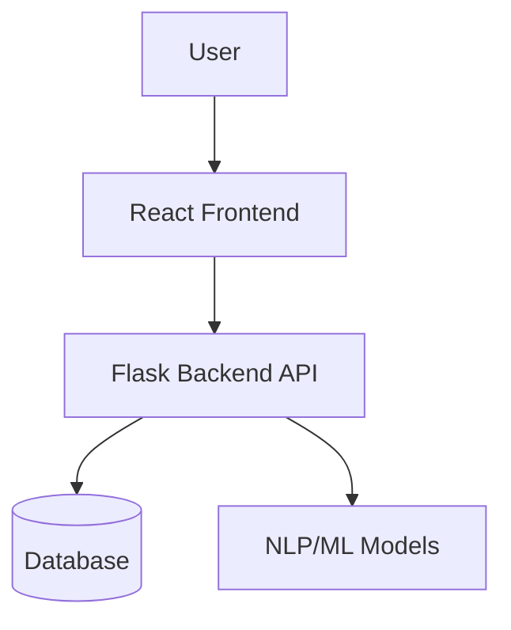
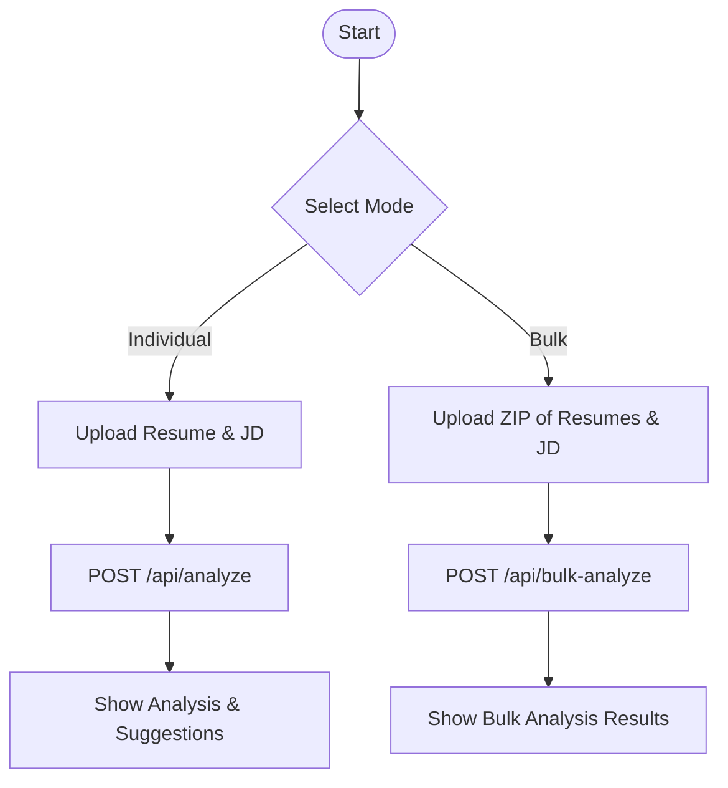
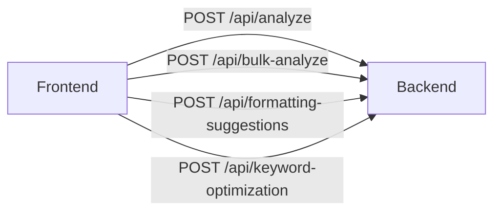

# ATS Resume Analyzer

A web application for analyzing resumes against job descriptions using AI, with both individual and bulk analysis modes. Built with a Flask backend and a React frontend.

## Features
- Analyze individual resumes against job descriptions
- Bulk analysis of multiple resumes (ZIP upload)
- Resume formatting suggestions
- Keyword optimization suggestions
- Modern, user-friendly web interface

## System Architecture



## Feature Flow



## API Endpoints Overview



## Folder Structure
```
ATS_ai/
  backend/      # Flask backend API
  frontend/     # React frontend app
  README.md     # Project documentation
  .gitignore    # Git ignore rules
```

## Setup Instructions

### Prerequisites
- Python 3.8+
- Node.js 14+

### Backend Setup
```bash
cd backend
python -m venv venv
source venv/bin/activate  # On Windows: venv\Scripts\activate
pip install -r requirements.txt
python app.py
```

### Frontend Setup
```bash
cd frontend
npm install
npm start
```

The backend runs on `http://localhost:5000` and the frontend on `http://localhost:3000` by default.

## API Endpoints
- `POST /api/analyze`: Analyze a single resume (PDF) and job description
- `POST /api/bulk-analyze`: Analyze multiple resumes (ZIP of PDFs) and job description
- `POST /api/formatting-suggestions`: Get formatting suggestions for a resume
- `POST /api/keyword-optimization`: Get keyword optimization suggestions

### Sample Backend Route (Flask)
```python
@app.route('/api/analyze', methods=['POST'])
def analyze_resume():
    if 'resume' not in request.files or 'job_description' not in request.form:
        return jsonify({'error': 'Missing resume or job description'}), 400
    resume_file = request.files['resume']
    job_description = request.form['job_description']
    resume_text = ats_backend.extract_text_from_pdf(resume_file)
    ats_backend.set_job_description(job_description)
    analysis = ats_backend.analyze_resume(resume_text, job_description)
    return jsonify(analysis)
```

### Sample Frontend API Call (React)
```javascript
const formData = new FormData();
formData.append('resume', file);
formData.append('job_description', jobDescription);

fetch('http://localhost:5000/api/analyze', {
  method: 'POST',
  body: formData,
})
  .then(res => res.json())
  .then(data => setAnalysis(data));
```

### Sample API Request/Response
**Request:**
`POST /api/analyze`
Form Data:
- resume: (PDF file)
- job_description: "Looking for a Python developer with NLP experience."

**Response:**
```json
{
  "score": 85,
  "matched_keywords": ["Python", "NLP", "Flask"],
  "suggestions": ["Add more details about your NLP projects."]
}
```

## Usage
1. Start both backend and frontend servers as above.
2. Open the frontend in your browser.
3. Upload resumes and job descriptions as prompted.

## Contributing
Pull requests are welcome! For major changes, please open an issue first to discuss what you would like to change.

## License
[Specify your license here, e.g., MIT] 