# SmartScreen ATS

SmartScreen ATS is an intelligent, AI-powered Applicant Tracking System designed to revolutionize the recruitment process for both job seekers and recruiters. Leveraging advanced natural language processing and machine learning, it analyzes resumes and job descriptions to deliver highly accurate candidate-job matches. The platform supports both individual and bulk resume analysis, offering actionable feedback and keyword optimization suggestions to candidates. Recruiters benefit from automated candidate ranking, skill extraction, and streamlined filtering, making hiring faster and more effective. With a modern React frontend and a robust Flask backend, SmartScreen ATS ensures a seamless, user-friendly experience. Whether you’re a candidate aiming to optimize your CV or a recruiter seeking the perfect fit, SmartScreen ATS empowers you to make smarter hiring decisions. Unlock the future of recruitment with data-driven insights and automation.

## Features
- Analyze individual resumes against job descriptions
- Bulk analysis of multiple resumes (ZIP upload)
- Resume formatting suggestions
- Keyword optimization suggestions
- Modern, user-friendly web interface

## System Architecture


## Feature Flow


## API Endpoints Overview

```mermaid
flowchart LR
    API1["🔍 <b>POST</b> /api/analyze"] --> BE["🧠 <b>Backend</b>"]
    API2["📁 <b>POST</b> /api/bulk-analyze"] --> BE
    API3["📝 <b>POST</b> /api/formatting-suggestions"] --> BE
    API4["💡 <b>POST</b> /api/keyword-optimization"] --> BE
    FE["🖥️ <b>Frontend</b>"] --> API1 & API2 & API3 & API4

     API1:::api
     BE:::backend
     API2:::api
     API3:::api
     API4:::api
     FE:::frontend
    
    classDef api fill:#e1f5fe,stroke:#0288d1,stroke-width:2px,color:#000
    style BE fill:#ffe9ba
    style FE fill:#fad7d7

```



## Folder Structure
```
ATS_ai/
  backend/      # Flask backend API
  frontend/     # React frontend app
  README.md     # Project documentation
  .gitignore    # Git ignore rules
```

## Backend Setup

1.  Navigate to the `backend` directory:
    ```bash
    cd backend
    ```
2.  Create a virtual environment:
    ```bash
    python -m venv venv
    ```
3.  Activate the virtual environment:
    *   On Windows:
        ```bash
        venv\Scripts\activate
        ```
    *   On macOS and Linux:
        ```bash
        source venv/bin/activate
        ```
4.  Install the required dependencies:
    ```bash
    pip install -r requirements.txt
    ```

## Frontend Setup

1.  Navigate to the `frontend` directory:
    ```bash
    cd frontend
    ```
2.  Install the required dependencies:
    ```bash
    npm install
    ```

## Running the Application

1.  **Start the Backend Server:**
    *   Navigate to the `backend` directory and run the following command:
        ```bash
        python app.py
        ```
    *   The backend server will start on `http://localhost:5000`.

2.  **Start the Frontend Development Server:**
    *   Navigate to the `frontend` directory and run the following command:
        ```bash
        npm start
        ```
    *   The frontend development server will start on `http://localhost:3000`.

3.  Open your web browser and navigate to `http://localhost:3000` to use the application.

## API Endpoints
- `POST /api/analyze`: Analyze a single resume (PDF) and job description
- `POST /api/bulk-analyze`: Analyze multiple resumes (ZIP of PDFs) and job description
- `POST /api/formatting-suggestions`: Get formatting suggestions for a resume
- `POST /api/keyword-optimization`: Get keyword optimization suggestions


## 🛠 Tools & Technologies
- Python  
- Flask  
- React.js  
- Pandas  
- Scikit-learn  
- Tailwind CSS  
- Gemini AI  
- Google Generative AI API  
- PDFMiner  

## 🔬 Techniques Used
- Prompt Engineering  
- Cosine Similarity  
- Named Entity Recognition (NER)  
- Keyword Matching


### Sample Backend Route (Flask)
```python
@app.route('/api/analyze', methods=['POST'])
def analyze_resume():
    if 'resume' not in request.files or 'job_description' not in request.form:
        return jsonify({'error': 'Missing resume or job description'}), 400
    resume_file = request.files['resume']
    job_description = request.form['job_description']
    resume_text = ats_backend.extract_text_from_pdf(resume_file)
    ats_backend.set_job_description(job_description)
    analysis = ats_backend.analyze_resume(resume_text, job_description)
    return jsonify(analysis)
```

### Sample Frontend API Call (React)
```javascript
const formData = new FormData();
formData.append('resume', file);
formData.append('job_description', jobDescription);

fetch('http://localhost:5000/api/analyze', {
  method: 'POST',
  body: formData,
})
  .then(res => res.json())
  .then(data => setAnalysis(data));
```

### Sample API Request/Response
**Request:**
`POST /api/analyze`
Form Data:
- resume: (PDF file)
- job_description: "Looking for a Python developer with NLP experience."

**Response:**
```json
{
  "score": 85,
  "matched_keywords": ["Python", "NLP", "Flask"],
  "suggestions": ["Add more details about your NLP projects."]
}
```

## Usage
1. Start both backend and frontend servers as above.
2. Open the frontend in your browser.
3. Upload resumes and job descriptions as prompted.

## Contributing
Pull requests are welcome! For major changes, please open an issue first to discuss what you would like to change.